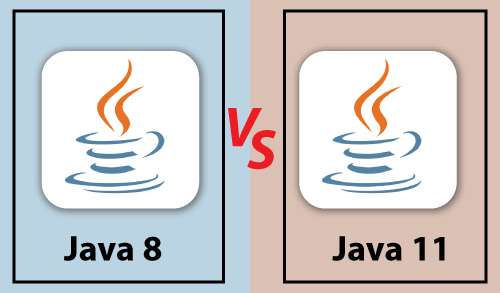

# Welcome To Java11 Training
## Contents
### **1.Working with Java Primitive Data Types and String APIs**

• *Primitive Data Type*

• *Declaring Primitive Types*

• Local Variable Initialization

• Narrowing and Widening

• Casting

• Scope

• `Local Variable Type Interference`

• **Local Variable Type Inference: Out of the Ordinary Concepts**

* String Recap

* Creating Strings

...
<!DOCTYPE html>
<html>
<body>

<h1>Session Started</h1>

Good Afternoon All !!!

Follow the following steps

</body>
</html>
...

1) Open Eclipse in Window

2) Create a Folder with name `Java-11-workspace`

3) Create a `test.java` file 

*What is the difference between Java8 & Java11*

4) Below is List of participants

Id | Name | MobNo | MailId
----|----|----|----|
CG1|Jayanti Prakash|90785634|Jayanti@cg.com
CG2|Somesh Sadar|90723154|somesh@cg.com

For more details you can visit github :  click on this [link](https://github.com/sarodepriya)

> [!WARNING]
> Dangerous certain consequences of an action

> [!NOTE]
> Information the user should notice even if skimming

https://github.com/sarodepriya/LearningGitRepository/blob/cfbe9dbdc40889efcc6de74d62caefdf72f0f980/JavaProject1-GitDemo/src/main/java/com/priyanka/git/Employee.java#L1

https://github.com/sarodepriya/java11-app/blob/04628ead3ef117487c5f9b881bb680ae15dd418f/src/index.html#L1-L10

